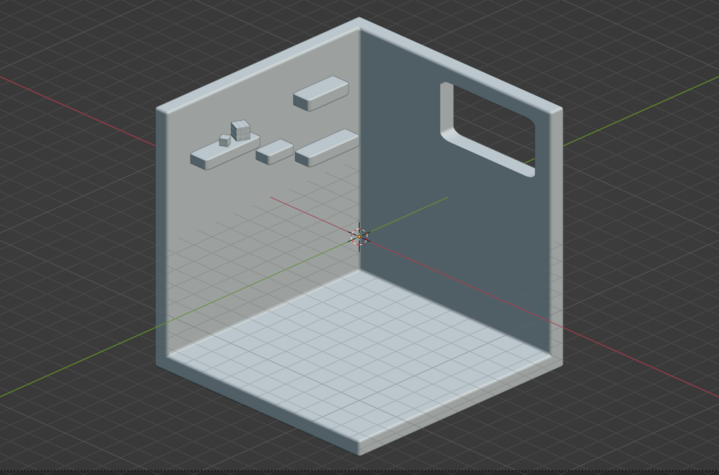

# IsometricRoom

## Hour 1

Sketched the idea for the room.

### Progress:

## Hour 2:

Made the room in blender added a window, some shelves and started on a rubiks cube.

### Progress:

## Hour 3:

Finished the 3x3 and made and started a 2x2 and pyraminx.

### Progress:

## Hour 4:

Made a skewb and started a megaminx

### Progress:

## Hour 5:

Finished the megaminx, made a new shelf and then made some books for the shelf

### Progress:

## Hour 6:

Made a pot plant and an arm chair

### Progress:

## Hour 7:

Made a bed with multiple layers of sheets and made a heart and square pillow.

### Progress:

## Hour 8:

Made another pillow for the bed, made a set of drawers and a lamp and book to go on it. Then I made a desk and started make a container to put pens in.

### Progress:

## HOur 9:

Made some pens and pu them in the pot, made a monitor and a book, made a floor mat and started making a monitor.

### Progress:

## Hour 10:

Made a chair, A lamp, Mats and made the window a better size

### Progress:

